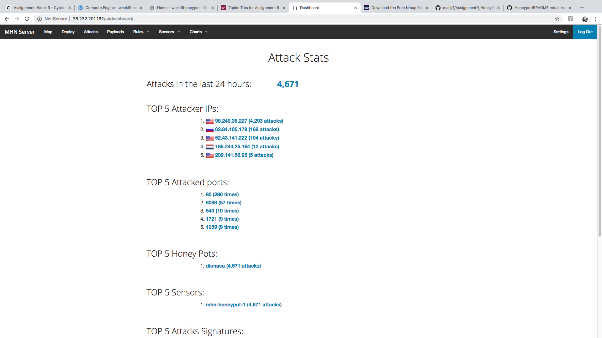

# Assignment9_HoneyPot

Total Time Spent: 12 hours

##Deployed Honeypot - Dionaea Over HTTP

	- I deployed the Dionaea Over HTTP HoneyPot as per the instuctions of the assignment.
	- As the assignment suggested, I used Google Cloud to provision the Admin and HoneyPot VMs.
	- Here is a walkthrough that shows my deployed honeypot intercepting my attack from my local machine.
		- GIF: 

##Issues Encountered

	- Initially, we were instructed to clone the RedolentSun/mhn.git repo, but it turned out that it wasn't available anymore.  So it took a really long time for me to figure out why the install.sh script was erroring out each time.  Later I was told to clone the /threatstream/mhn.git repo, and this solved the problem.
	- After setting up the HoneyPot once, and seeing the attacks intercepted in the browser console, I shut down my computer.  After logging on again later to create my session file, I tried to access the the external IP and it would simply not load.  I am still not clear as to why that happend.
	- Even though, the External IP was not loading, I still tried to create the session file.  However, I kept getting an error for the "mongoexport".  It couldn't not establish a valid connection to 127.0.0.1 and would error out each time.  I used mongo --repair to solve this, but then I got a different error saying that there are no servers to connect to.  To solve this I deleted both VMs, and reinstalled them and it worked fine.

##Summary of Data Collected

	- Here is a quick summary of all of the collected data from the HoneyPot:

	

##Unresolved Questions

	- I am still unclear as to why the mongoexport did not work initially and why it couldn't connect to 127.0.0.1.